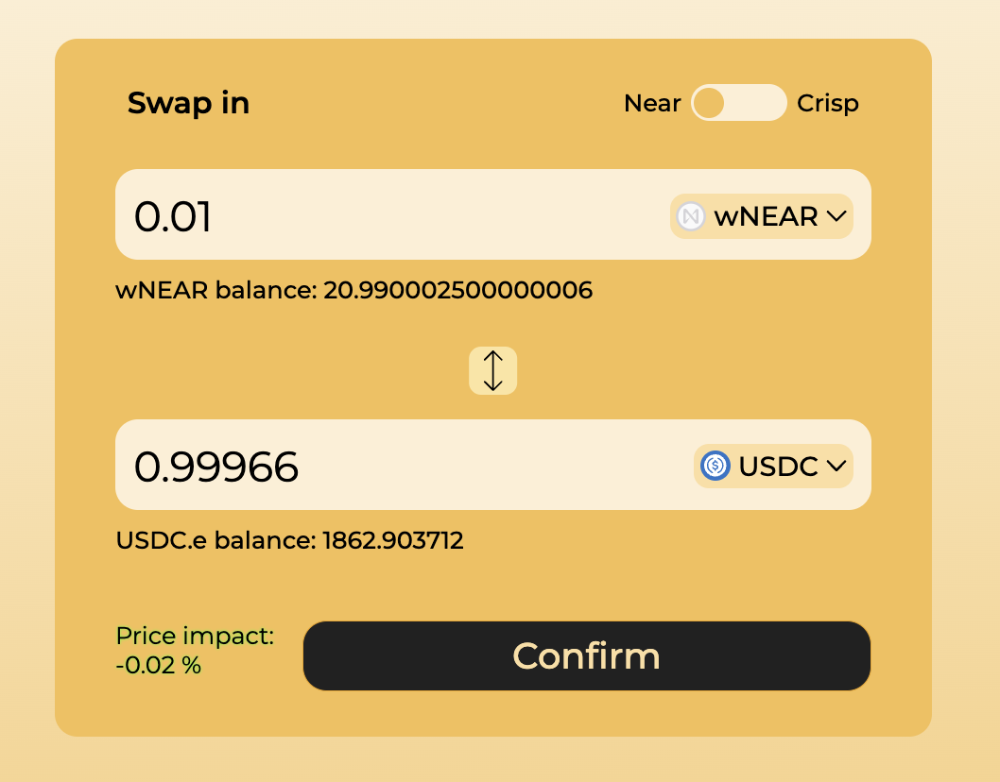
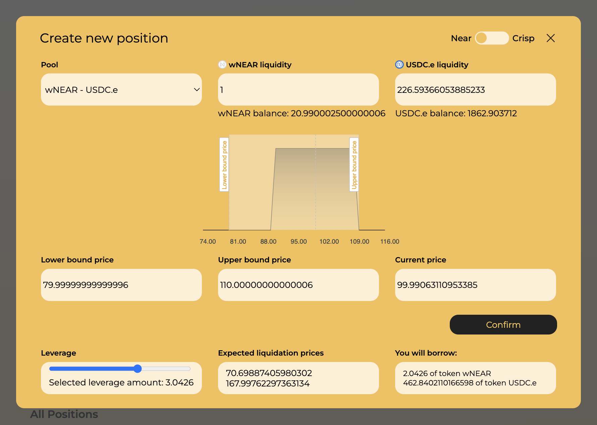
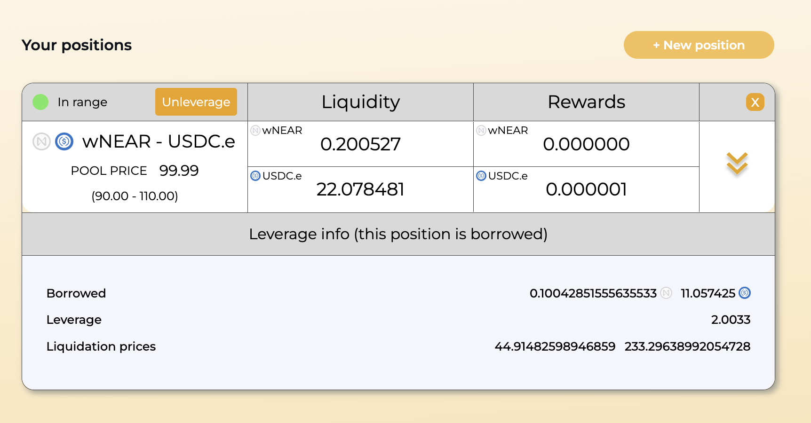
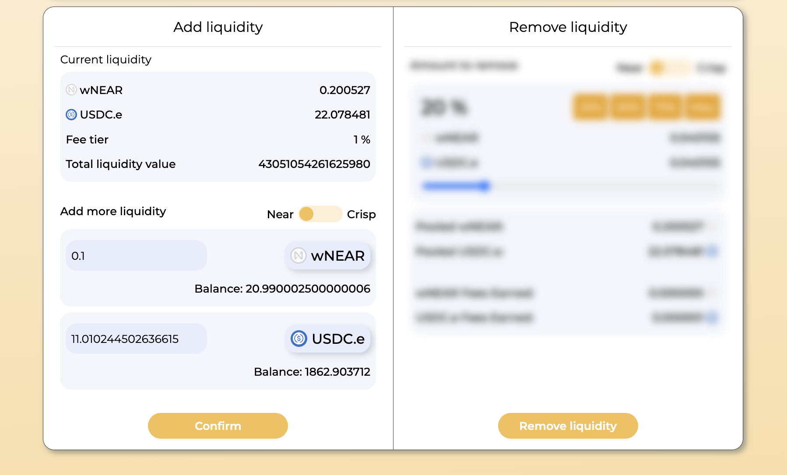
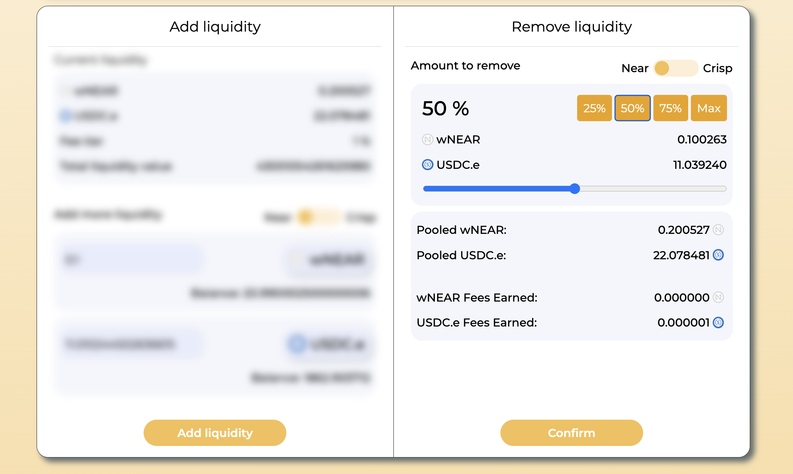
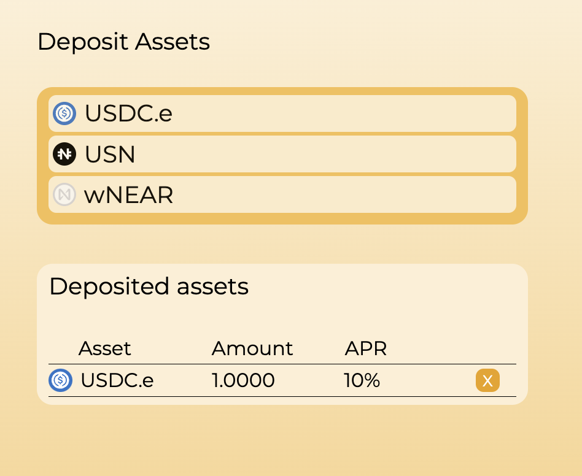

# Crisp frontend

[Crisp](https://crisp.exchange/) is an open-source structured liquidity protocol on the NEAR blockchain.

This repository contains the frontend.

There is also a [smart contract repository](https://github.com/Mycelium-Lab/crisp-exchange).

## Overview

The protocol is an advanced DEX where you can:
- trade with existing liquidity
- place concentrated liquidity positions in a chosen price range to earn trading fees
- leverage your positions up to 5x
- lend your tokens for others to borrow for leverage and earn interest
- liquidate underwater leveraged positions to earn a premium








## Project setup
```
npm i
```

### Compiles and hot-reloads for development
```
npm run serve
```

### Compiles and minifies for production
```
npm run build
```
